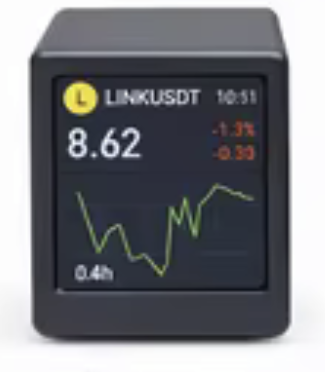
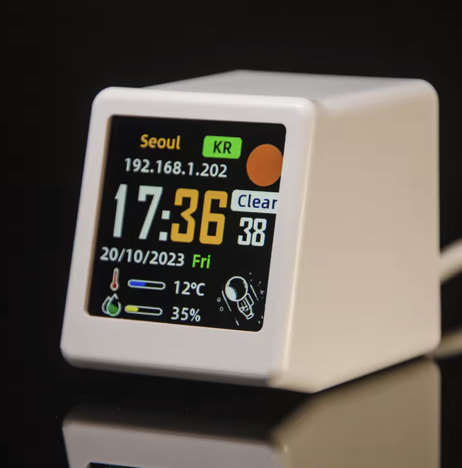
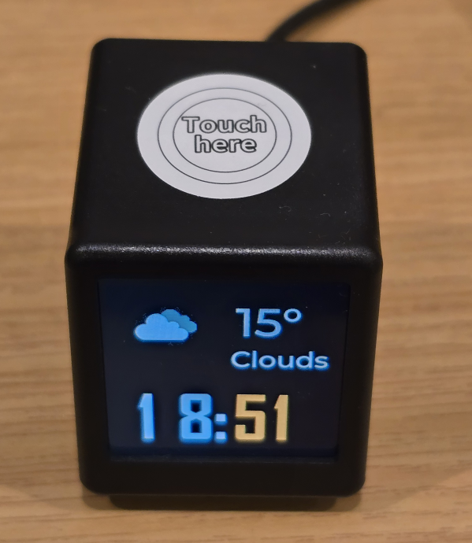

<p align="center">
  
</p>

<h1 align="center">smalltv-mod</h1>

<p align="center">
  <a href="https://github.com/giovi321/smalltv-mod/actions/workflows/build.yml"></a>
  <a href="https://github.com/giovi321/smalltv-mod/actions/workflows/docs.yml"></a>
  <a href="LICENSE"></a>
  
</p>

<p align="center">
  <a href="https://giovi321.github.io/smalltv-mod/"></a>
</p>

> Not affiliated with GeekMagic or Anthropic. This firmware replaces the stock firmware entirely.

The GeekMagic SmallTV is a cheap desk gadget: a little cube with a 1.54" colour screen, an ESP inside, and a USB-C port. This firmware throws away the stock apps and turns it into three things you actually watch. It shows a **stock and crypto ticker** with prices, change, and a sparkline. It flips into a **Claude usage meter** with an animated mascot and your 5-hour and 7-day usage bars. And it becomes a **live plane radar** centred on your location, pulled from a free public feed. One image carries all three; you switch between them in a built-in web UI, and you update over WiFi.

This firmware builds four images from one codebase, covering five devices. The original SmallTV runs an **ESP8266**; the **SmallTV-ultra** is the same ESP-12F hardware and screen, but its stock "Ultra" firmware and flash partitions block a normal OTA of this image, so it takes a two-step loader install (see [Flashing](#flashing)); a second version sold under the same "smart weather clock" look uses an **ESP32-C2 (ESP8684)** instead. A third build targets the **NMMiner NM-TV-154** (PCB marked "NM-TV-Miner"), a classic-ESP32 BTC lottery miner in the same cube with the same screen, confirmed working by a community tester in [issue #1](https://github.com/giovi321/smalltv-mod/issues/1). A fourth build targets the **GeekMagic SmallTV Pro**, a classic ESP32 with 8 MB flash and a touch button, confirmed working on hardware. Pick yours below.

<p align="center">
  
</p>

## Which one do I have

Check the board before you build, because the variants flash differently.

| | SmallTV (ESP8266) | SmallTV-ultra | SmallTV (ESP32-C2) | NM-TV-154 (ESP32) | SmallTV Pro (ESP32) |
|---|---|---|---|---|---|
| Photo |  |  |  |  |  |
| MCU | ESP-12F (ESP8266), 4 MB flash | same ESP-12F (ESP8266), 4 MB flash | ESP32-C2 / ESP8684, 4 MB flash | ESP32-WROOM-32E, 4 MB flash | classic ESP32, 8 MB flash |
| Build env | `smalltv`, or `smalltv_lean` | `smalltv` (same image, `smalltv_loader` to install) | `smalltv_c2` | `smalltv_esp32` | `smalltv_esp32_8mb` |
| Display | 1.54" 240×240 IPS ST7789 | same panel | same panel, RGB order | same panel | same panel |
| Flashing | OTA from the stock web UI, or UART header | two-step [loader](#flashing) then OTA, or UART | USB-C via the onboard CH340C (esptool) | USB via esptool | OTA from the stock web UI, or UART header |
| WireGuard VPN | no, the chip has neither the flash nor the heap | no, same chip | yes | no, the 4 MB image has no room left for it | yes, the 8 MB layout has room to spare |
| Tell-tale | ESP8266 module, no USB-serial chip | stock firmware branded "Ultra", OTA of this image fails with "Not Enough Space" | CH340C chip next to the USB-C port | PCB reads "NM-TV-Miner" | sold as "SmallTV Pro", touch button on top |

The screens in the photos above are each unit's **stock firmware**, not this one, and they differ by model and firmware version (the ultra ships as a weather clock, the original as a ticker, and so on). Use the on-screen look as a first clue to which model you are holding, then confirm with the tell-tale row, because the binary and the install method differ per model. If your board has a **CH340C** chip beside the USB-C port and the main chip reads **ESP8684**, you have the ESP32-C2 model. Full teardown photos and pin maps are in [Hardware and variants](https://giovi321.github.io/smalltv-mod/getting-started/hardware/).

## What it does

- **Stock and crypto ticker.** Price, absolute change, percent change with an up/down arrow, and a sparkline. Up to 8 symbols rotate on a timer. Data comes straight from Yahoo Finance over HTTPS with no backend, from cash.ch for Swiss instruments Yahoo doesn't carry (structured products, AMCs, tracker certificates), or from your own webhook if you want to own the source. Stocks, ETFs, Swiss equities (`NESN.SW`), crypto (`BTC-USD`), and FX (`EURUSD=X`) all work. Add a quantity and cost basis to any ticker and it shows your P/L, with a portfolio summary page in the rotation.
- **Claude usage meter.** An animated pixel mascot plus your 5-hour and 7-day usage as big percentages with fill bars and reset countdowns. It needs the [clawdmeter-daemon](https://github.com/giovi321/clawdmeter-daemon) running on your PC, which reads the usage and sends it over WiFi; the screen shows only an idle animation without it. When the data stops, the mascot plays an idle animation until it comes back. Running several devices, the daemon discovers them over mDNS and pushes to all of them.
- **Plane radar.** A scope centred on your location with nearby aircraft as heading triangles, speed vectors, and callsign or altitude labels, from the free [adsb.lol](https://adsb.lol) or [adsb.fi](https://adsb.fi) APIs or a LAN webhook. Marker size, an altitude filter, and label decluttering are configurable.
- **Home Assistant screens over MQTT.** Publish a small JSON draw list to a LAN broker and the device shows it as a full 240×240 screen. Each carousel slot gets one retained message, and the device rotates through them. Not included in the lean ESP8266 image. See [Home Assistant screens](https://giovi321.github.io/smalltv-mod/features/ha/).
- **Web UI for everything.** Join WiFi (up to 4 saved networks), pick the mode or a carousel that rotates through them, manage the symbol list, set brightness, orientation, and the panel's colour balance, set an NTP timezone and a nightly dimming schedule (night brightness, 0 = screen off), and back up or restore the whole configuration as a file. First boot creates a `SmallTV-Setup` hotspot with a captive portal.
- **WireGuard VPN, on the ESP32-C2 and the SmallTV Pro.** A built-in tunnel, so you can reach the device from outside your LAN without forwarding its plain-HTTP port to the internet. Configured in the WiFi tab: private key, peer public key, endpoint, tunnel address, allowed IPs. Three crash reboots in a row hold the tunnel down at the next boot, so a bad tunnel config cannot lock you out of the settings page. Whether a board gets it comes down to how much of its update slot the image already uses; see [WireGuard VPN](https://giovi321.github.io/smalltv-mod/features/wireguard/) for the numbers.
- **Optional password on the web UI.** Off by default, so nothing changes unless you want it to. Turn it on in the System tab and the settings page, the API, and the firmware upload all sit behind HTTP digest auth, which keeps the password off the wire on a plain-HTTP LAN. The clawdmeter push endpoint stays open, since the daemon cannot send credentials and can only change what the screen shows. There is no recovery for a forgotten password other than reflashing over a cable.
- **Updates over WiFi.** Every board pulls the newest release from GitHub itself from the web UI's System tab, or takes a manual firmware upload from the browser. On the ESP8266 the download runs at boot (the device reboots twice). **Warning: ESP8266 devices on firmware 2.6.1 or older cannot self-update** (the updater itself was broken; it fails with "connection failed"). Update those once manually: upload `smalltv-mod-firmware.bin` from the [Releases page](https://github.com/giovi321/smalltv-mod/releases) in the System tab. From 2.7.0 on, self-update works everywhere.

## Get the firmware

You do not need a toolchain. GitHub Actions builds the images for all the boards.

- Every push: the **Actions** tab, latest `build` run, download the firmware artifact.
- Tagged releases (`vX.Y.Z`): attached to the [Releases](../../releases) page.

Nine files come with each release. Pick by board first, then by whether you are installing for the first time or updating:

| File | Board | Use it for |
|------|-------|-----------|
| `smalltv-mod-firmware.bin` | SmallTV, SmallTV-ultra (ESP8266) | The normal install and every later update |
| `smalltv-mod-firmware-lean.bin` | Same ESP8266 boards | The same device when it needs more heap. HA screens and the usage meter are compiled out |
| `smalltv-mod-loader.bin` | SmallTV-ultra (ESP8266) | One-time first install when the stock updater rejects the full image |
| `smalltv-mod-firmware-c2.bin` | SmallTV (ESP32-C2) | Updates |
| `smalltv-mod-firmware-c2.factory.bin` | SmallTV (ESP32-C2) | First install over USB-C |
| `smalltv-mod-firmware-esp32.bin` | NM-TV-154 (ESP32) | Updates |
| `smalltv-mod-firmware-esp32.factory.bin` | NM-TV-154 (ESP32) | First install over USB |
| `smalltv-mod-firmware-esp32-pro.bin` | SmallTV Pro (ESP32, 8 MB) | First install over the stock web UI, and every later update |
| `smalltv-mod-firmware-esp32-pro.factory.bin` | SmallTV Pro (ESP32, 8 MB) | Direct install or recovery over the UART header |

The names follow one pattern, `smalltv-mod-<image>[-<target>][.factory].bin`. No target suffix means the original ESP8266; `-lean`, `-c2`, `-esp32`, and `-esp32-pro` name the others. A `.factory` image is the merged bootloader, partition table, and app, written at offset `0x0` over a cable; without it the file is an app image sized for an OTA slot. The System tab shows which variant a device runs, and self-update keeps it on that variant. Full detail in [Which release file to download](https://giovi321.github.io/smalltv-mod/reference/release-assets/).

Or [build it yourself](#building-from-source).

## Flashing

The right method depends on your board. The steps below are the short version; the [Flashing guide](https://giovi321.github.io/smalltv-mod/getting-started/flashing/) covers recovery, backups, and troubleshooting.

**SmallTV (ESP8266).** The stock firmware exposes an OTA updater, so you can install this without opening the device. Find its IP, browse to `http://<device-ip>/update`, and upload `smalltv-mod-firmware.bin`, or `smalltv-mod-firmware-lean.bin` for the build that trades Home Assistant screens and the usage meter for 8,732 bytes of heap. Back up the stock image first if you might want it back.

**SmallTV-ultra.** Same ESP8266 hardware, but the stock "Ultra" firmware reserves most of the flash for image storage, so its OTA slot is too small for `smalltv-mod-firmware.bin` and rejects it with `Not Enough Space`. Install in two steps, no soldering: flash `smalltv-mod-loader.bin` at `http://<device-ip>/update` (it fits the small slot), join the open `SmallTV-Loader` AP it opens at `192.168.4.1`, then upload `smalltv-mod-firmware.bin` at `http://192.168.4.1/update`. UART is the fallback (`esptool write_flash 0x0 smalltv-mod-firmware.bin`).

**SmallTV (ESP32-C2).** Flash over the USB-C cable with esptool, which talks to the onboard CH340C. Auto-reset works, so no button is needed. Back up the stock image first, then write `smalltv-mod-firmware-c2.factory.bin` from the [Releases](../../releases) page:

```bash
# back up the original 4 MB image first
python -m esptool --chip esp32c2 --port COM3 read_flash 0x0 0x400000 stock-backup.bin

# write this firmware (merged image at 0x0)
python -m esptool --chip esp32c2 --port COM3 --baud 921600 write_flash 0x0 smalltv-mod-firmware-c2.factory.bin
```

**NM-TV-154 (ESP32).** Flash over USB with esptool the same way as the C2, with `--chip esp32` and `smalltv-mod-firmware-esp32.factory.bin` from the [Releases](../../releases) page (or a local `pio run -e smalltv_esp32` build). Back up the stock image first (`read_flash 0x0 0x400000 stock-backup.bin`).

**SmallTV Pro (ESP32, 8 MB).** No USB-serial chip: the USB-C port is power only. Install over the air from the stock web UI: browse to `http://<device-ip>/update` and upload `smalltv-mod-firmware-esp32-pro.bin` (this firmware's partition layout matches stock, so the stock updater takes it directly). To back up the stock image first (recommended, since it is not redistributed anywhere), or to recover, open the case and wire a 3.3 V USB-UART adapter to the internal header: `read_flash 0x0 0x800000 stock-backup.bin`, and `write_flash 0x0 smalltv-mod-firmware-esp32-pro.factory.bin` for a direct install.

After the first flash, every board updates from the browser under the web UI's System tab.

## First-time setup

1. On first boot the device shows **SETUP MODE** and creates an open `SmallTV-Setup` hotspot.
2. Join it. A captive portal should open; if not, browse to `http://192.168.4.1`.
3. Open **WiFi**, scan, pick your 2.4 GHz network, enter the password, and save. The device reboots and joins.
4. It shows the network, its IP, and its `http://<hostname>.local` address on screen. Browse to either one.
5. Add a few tickers under **Ticker** (for example `AAPL`, `NESN.SW`, `BTC-USD`). Each ticker picks its own source; Yahoo Finance is the default, so it works immediately.

The [First-time setup guide](https://giovi321.github.io/smalltv-mod/getting-started/setup/) walks through the web UI tab by tab.

## Documentation

Full docs live at **[giovi321.github.io/smalltv-mod](https://giovi321.github.io/smalltv-mod/)**:

- Received one already set up (as a gift, say)? Start at the [user manual](https://giovi321.github.io/smalltv-mod/manual/quick-start/) instead, no technical background assumed
- [Hardware and variants](https://giovi321.github.io/smalltv-mod/getting-started/hardware/) with pin maps for every board
- [Flashing](https://giovi321.github.io/smalltv-mod/getting-started/flashing/) and [first-time setup](https://giovi321.github.io/smalltv-mod/getting-started/setup/)
- The three modes: [ticker](https://giovi321.github.io/smalltv-mod/features/ticker/), [Claude usage](https://giovi321.github.io/smalltv-mod/features/usage/), [plane radar](https://giovi321.github.io/smalltv-mod/features/radar/)
- [WireGuard VPN](https://giovi321.github.io/smalltv-mod/features/wireguard/) for reaching the device from outside your network, and [Notifications](https://giovi321.github.io/smalltv-mod/features/notify/) for pushing an alert to the screen
- [Data sources](https://giovi321.github.io/smalltv-mod/reference/data-sources/), [building from source](https://giovi321.github.io/smalltv-mod/reference/building/), and [recovery](https://giovi321.github.io/smalltv-mod/reference/recovery/)

## 3D-printed case

A flat desk case with a stand lives in [case/](case/): an STL ready to slice, plus a preview render.

## Building from source

Requires [PlatformIO](https://platformio.org/). Pick the env for your board:

```bash
pio run -e smalltv                 # ESP8266
pio run -e smalltv_lean            # ESP8266, without HA screens or the usage meter
pio run -e smalltv_c2              # ESP32-C2
pio run -e smalltv_esp32           # NM-TV-154 (classic ESP32)
pio run -e smalltv_esp32_8mb       # SmallTV Pro (classic ESP32, 8 MB)
pio run -e smalltv_c2 -t upload    # build + flash the C2 over USB-C
pio device monitor -e smalltv_c2   # serial logs @ 115200
```

The five images build from one codebase. Chip differences live in `src/Platform.h` and the per-board pin headers (`src/board_esp8266.h`, `src/board_esp32c2.h`, `src/board_esp32.h`, `src/board_esp32_pro.h`); the three feature modes and the web UI are identical across all of them. See [Building from source](https://giovi321.github.io/smalltv-mod/reference/building/) for the project layout and the ESP32 toolchain notes.

The PC-side usage daemon lives in its own repo: [clawdmeter-daemon](https://github.com/giovi321/clawdmeter-daemon).

## Credits and references

- GeekMagic SmallTV and SmallTV-Pro, the original product and stock firmware ([GeekMagicClock/smalltv-pro](https://github.com/GeekMagicClock/smalltv-pro)).
- Pin maps and hardware notes from the ESPHome and Tasmota communities:
  - [ViToni/esphome-geekmagic-smalltv](https://github.com/ViToni/esphome-geekmagic-smalltv)
  - [Installing ESPHome on a new smart weather clock (HA community)](https://community.home-assistant.io/t/installing-esphome-on-new-smart-weather-clock-wifi-weather-station-display/1006172), which documented the ESP32-C2 pin map
  - [Puddle of Code, My Own GeekMagic SmallTV](https://puddleofcode.com/story/my-own-geekmagic-smalltv/)
  - [NMMiner's NM-TV-154 custom firmware guide](https://www.nmminer.com/2026/03/02/how-to-develop-nm-tv-custom-firmware/), which documents the NM-TV-154 pin map
- The plane radar's look reimplements [MatixYo/ESP32-Plane-Radar](https://github.com/MatixYo/ESP32-Plane-Radar), a sonar-style ADS-B radar for a 1.28" round display: heading triangles, speed vectors, callsign and altitude tags, and rim dots for out-of-range traffic all come from that design.
- Claude usage mode reimplements [clawdmeter](https://github.com/HermannBjorgvin/Clawdmeter) for this hardware; the mascot frames come from [claudepix](https://claudepix.vercel.app).
- Libraries: [Arduino_GFX](https://github.com/moononournation/Arduino_GFX), [ArduinoJson](https://arduinojson.org/).

## License

[WTFPL](LICENSE). Do What The F*ck You Want To Public License.
